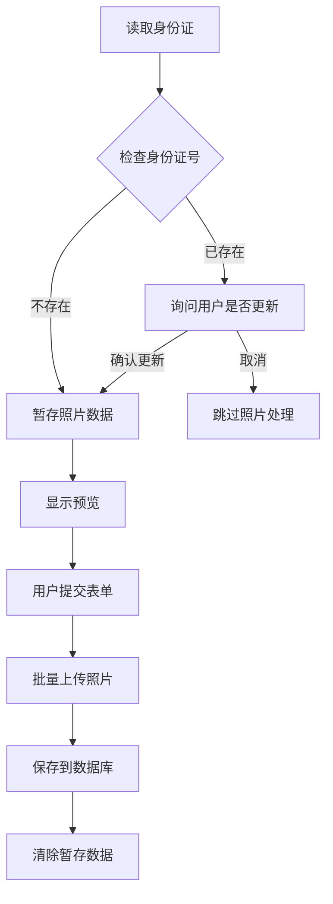

# 2025-08-20 照片上传优化

## 🎯 问题描述

**原始问题**: 身份证读取时每次都会立即上传照片，导致：
- ❌ 重复上传相同身份证的照片
- ❌ 网络资源浪费
- ❌ 用户体验不佳（频繁上传提示）
- ❌ 服务器存储空间浪费

## 🚀 优化方案

### 核心思路
**从"立即上传"改为"延迟上传 + 重复检测"**

```
修复前：读取身份证 → 立即上传照片 → 重复上传
修复后：读取身份证 → 检查用户存在性 → 暂存照片 → 提交时统一上传
```

### 技术实现

#### 1. 数据库模式更新
**文件**: `backend/prisma/schema.prisma`

```prisma
model Student {
  // ... 其他字段 ...
  photo             String?      // 🆕 个人照片URL
  idCardFront       String?      // 身份证正面
  idCardBack        String?      // 身份证背面
  // ... 其他字段 ...
}
```

**执行的迁移**:
```bash
npx prisma migrate dev --name add-student-photo-field
```

#### 2. 前端暂存机制
**文件**: `frontend/src/views/Registration.vue`

**新增暂存数据结构**:
```typescript
// 暂存照片数据，避免重复上传
const pendingPhotoData = ref({
  photo: '',        // 个人头像base64
  idCardFront: '',  // 身份证正面base64
  idCardBack: ''    // 身份证背面base64
})
```

#### 3. 读卡优化逻辑
**文件**: `frontend/src/views/Registration.vue`

**修复前 (立即上传)**:
```typescript
// ❌ 每次读卡都立即上传
if (idCardData.base64Data) {
  const photoUrl = await uploadBase64Image(base64Photo, 'photo')
  formData.photo = photoUrl
}
```

**修复后 (智能处理)**:
```typescript
// ✅ 先检查用户是否存在
if (formData.idNumber) {
  const checkResponse = await ApplicationService.checkIdNumber(formData.idNumber)
  if (checkResponse.data.exists) {
    // 用户已存在，询问是否更新照片
    Modal.confirm({
      title: '身份证号已存在',
      content: '是否要更新照片信息？',
      onOk: () => processIdCardPhotos(idCardData)
    })
    return
  }
}

// 新用户：暂存照片，等提交时上传
await processIdCardPhotos(idCardData)
```

#### 4. 批量上传机制
**文件**: `frontend/src/views/Registration.vue`

**统一上传函数**:
```typescript
const uploadPendingPhotos = async (): Promise<void> => {
  // 批量上传所有暂存的照片
  if (pendingPhotoData.value.photo?.startsWith('data:')) {
    const photoUrl = await uploadBase64Image(pendingPhotoData.value.photo, 'photo')
    if (photoUrl) formData.photo = photoUrl
  }
  
  if (pendingPhotoData.value.idCardFront?.startsWith('data:')) {
    const frontUrl = await uploadBase64Image(pendingPhotoData.value.idCardFront, 'front')
    if (frontUrl) formData.idCardFront = frontUrl
  }
  
  if (pendingPhotoData.value.idCardBack?.startsWith('data:')) {
    const backUrl = await uploadBase64Image(pendingPhotoData.value.idCardBack, 'back')
    if (backUrl) formData.idCardBack = backUrl
  }
}
```

#### 5. 提交流程优化
**文件**: `frontend/src/views/Registration.vue`

```typescript
const handleSubmit = async (): Promise<void> => {
  // 1. 表单验证
  await formRef.value.validate()
  
  // 2. 批量上传暂存照片
  await uploadPendingPhotos()
  
  // 3. 提交申请数据
  const response = await ApplicationService.submitApplication(submitData)
  
  // 4. 成功后清理
  if (response.code === 200) {
    handleReset()
    clearPendingPhotos()
  }
}
```

## 🎯 优化效果

### 性能提升
- 🚀 **网络请求减少**: 从多次上传到一次批量上传
- 📊 **存储优化**: 避免重复存储相同用户的照片
- ⚡ **响应速度**: 身份证读取即时响应，无需等待上传

### 用户体验改进
- 📱 **流畅操作**: 读卡无延迟，提交时统一处理
- 💬 **智能提示**: 重复用户有选择权
- 🎯 **操作明确**: 用户知道何时会上传照片

### 数据完整性
- ✅ **字段映射**: `Student.photo` 字段正确保存个人头像
- ✅ **URL存储**: 统一存储文件路径，不存储base64
- ✅ **默认处理**: 未上传照片时显示默认头像

## 📊 对比分析

| 方面 | 修复前 | 修复后 | 改进效果 |
|------|--------|--------|----------|
| **上传时机** | 读卡时立即上传 | 提交时批量上传 | ⬆️ 减少网络请求 |
| **重复处理** | 无检测，重复上传 | 智能检测，用户选择 | ⬆️ 避免重复存储 |
| **用户体验** | 频繁提示上传 | 一次性处理 | ⬆️ 操作更流畅 |
| **数据存储** | 可能重复存储 | 避免重复，优化存储 | ⬆️ 节省空间 |
| **错误处理** | 分散的错误处理 | 集中错误处理 | ⬆️ 更好的错误反馈 |

## 🔧 技术细节

### 照片处理流程


### 数据流转
```
身份证读卡器 → base64数据 → pendingPhotoData暂存 → 表单提交触发 → 批量上传API → 文件系统存储 → 数据库保存URL → 前端展示
```

### 防重复机制
1. **身份证号检查**: 读卡前检查是否已注册
2. **用户确认**: 重复用户可选择是否更新照片
3. **暂存管理**: 未提交的照片数据临时存储
4. **清理机制**: 提交成功或重置时清除暂存

## ⚠️ 注意事项

### 用户交互
- 🔔 **明确提示**: 告知用户照片将在提交时上传
- ⚙️ **选择权限**: 重复用户可决定是否更新照片
- 📱 **预览功能**: 暂存照片可实时预览

### 数据安全
- 🔒 **内存管理**: 暂存数据在提交后立即清除
- 🛡️ **类型安全**: base64数据验证后再上传
- 📋 **日志记录**: 完整的上传过程日志

---

**开发者**: AI Assistant  
**测试状态**: ✅ 逻辑验证完成  
**性能影响**: 🚀 **显著提升** - 减少不必要的网络请求  
**用户价值**: 🎯 **体验优化** - 更流畅的报名流程  
