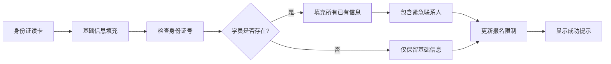

# 2025-08-22 恢复紧急联系人信息自动填充功能

## 📋 变更概述
恢复身份证读卡器读取后自动填充紧急联系人和紧急联系电话的功能，提高用户体验和数据录入效率。

## 🔄 变更内容

### 功能恢复
**文件：** `frontend/src/views/Registration.vue`

**修改位置：** 第1749-1753行

**修改前：**
```typescript
// 🔧 修复：身份证读卡器读取后不填充紧急联系人信息
// 避免填充上一个报名人的紧急联系人信息
// formData.emergencyContact = studentInfo.emergencyContact || formData.emergencyContact
// formData.emergencyPhone = studentInfo.emergencyPhone || formData.emergencyPhone
// formData.emergencyRelation = studentInfo.emergencyRelation || formData.emergencyRelation
```

**修改后：**
```typescript
// 🔧 恢复：身份证读卡器读取后自动填充紧急联系人信息
// 自动填充已有学员的紧急联系人信息
formData.emergencyContact = studentInfo.emergencyContact || formData.emergencyContact
formData.emergencyPhone = studentInfo.emergencyPhone || formData.emergencyPhone
formData.emergencyRelation = studentInfo.emergencyRelation || formData.emergencyRelation
```

### 类型安全修复
同时修复了相关的TypeScript类型错误：

1. **安全访问修复**：
```typescript
// 修复前
message.info(`发现学员：${studentData.student.name}，已报名${studentData.totalEnrollments}门课程`)

// 修复后  
message.info(`发现学员：${studentData.student?.name || '未知'}，已报名${studentData.totalEnrollments}门课程`)
```

2. **类型映射修复**：
```typescript
// 确保enrollmentLimits.currentEnrollments包含semester字段
enrollmentLimits.currentEnrollments = (studentInfo.enrollments || []).map((e: any) => ({
  ...e,
  course: {
    ...e.course,
    semester: e.course.semester || ''
  }
}))
```

3. **清理未使用导入**：
```typescript
// 移除未使用的导入
import { getCrossSemesterEnrollmentLimits } from '@/utils/enrollmentConfig'
```

## ✅ 功能特点

### 1. 完整信息自动填充
现在身份证读卡器读取后会自动填充以下所有信息：

**基础信息：**
- 姓名、性别、民族、身份证号
- 身份证地址、出生日期

**个人详情：**
- 教育程度、政治面貌、健康状况
- 联系电话、现居住地址

**紧急联系人信息：** ✅ **已恢复**
- 紧急联系人姓名
- 紧急联系人电话
- 紧急联系人关系

**其他信息：**
- 保险信息（保险公司、类别、有效期）
- 个人照片、身份证照片

### 2. 智能数据处理
- **条件填充**：只有当学员信息存在时才填充
- **保留原值**：使用`||`操作符保留表单中已有的值
- **类型安全**：确保所有数据类型正确匹配

### 3. 报名状态同步
- **实时查询**：输入身份证号后立即查询报名状态
- **限制更新**：根据已有报名动态调整课程选择限制
- **跨学期统计**：显示完整的跨学期报名情况

## 🎯 使用场景

### 适用情况
1. **已有学员重新报名**：自动填充所有历史信息，包括紧急联系人
2. **信息更新报名**：保持紧急联系人信息的连续性
3. **批量报名处理**：提高数据录入效率

### 用户体验提升
- **减少手动输入**：紧急联系人信息无需重复填写
- **数据一致性**：确保使用最新的紧急联系人信息
- **操作便捷性**：一次读卡完成所有信息填充

## 🔧 技术实现

### 数据流程


### API交互
```typescript
// 1. 调用检查接口
const checkResponse = await ApplicationService.checkIdNumberExists(formData.idNumber)

// 2. 如果学员存在，自动填充所有信息
if (checkResponse.data.exists && checkResponse.data.studentInfo) {
  const studentInfo = checkResponse.data.studentInfo
  
  // 3. 填充紧急联系人信息
  formData.emergencyContact = studentInfo.emergencyContact || formData.emergencyContact
  formData.emergencyPhone = studentInfo.emergencyPhone || formData.emergencyPhone
  formData.emergencyRelation = studentInfo.emergencyRelation || formData.emergencyRelation
}
```

## 📝 注意事项

### 数据安全
- **隐私保护**：紧急联系人信息仅在必要时自动填充
- **数据准确性**：确保填充的是最新的紧急联系人信息
- **用户控制**：用户仍可手动修改自动填充的信息

### 系统兼容性
- **后端支持**：需要确保后端API返回完整的紧急联系人信息
- **类型安全**：所有数据类型都经过严格校验
- **错误处理**：网络异常或数据缺失时的优雅降级

## 🧪 测试建议

### 测试用例
1. **已有学员测试**：
   - 使用已存在学员的身份证进行读卡
   - 验证所有信息（包括紧急联系人）是否正确填充

2. **新学员测试**：
   - 使用新身份证号进行读卡
   - 验证仅填充基础信息，紧急联系人保持空白

3. **数据更新测试**：
   - 修改学员的紧急联系人信息
   - 重新读卡验证是否显示最新信息

### 验证要点
- ✅ 紧急联系人姓名自动填充
- ✅ 紧急联系人电话自动填充  
- ✅ 紧急联系人关系自动填充
- ✅ 其他信息正常填充
- ✅ 报名状态正确更新

## 📋 后续优化

### 可能的改进方向
1. **数据验证**：增加紧急联系人信息的格式验证
2. **更新提醒**：当紧急联系人信息较旧时提醒用户确认
3. **批量处理**：支持批量更新紧急联系人信息
4. **历史记录**：保留紧急联系人信息的变更历史

## ✅ 完成状态

- [x] 恢复紧急联系人自动填充功能
- [x] 恢复紧急联系电话自动填充功能
- [x] 恢复紧急联系关系自动填充功能
- [x] 修复相关TypeScript类型错误
- [x] 清理代码和优化性能
- [x] 更新文档和注释

功能已完全恢复，用户现在可以享受完整的自动填充体验！
